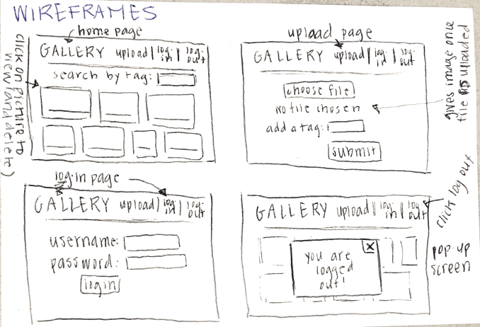

# Project 3 - Design & Plan

Your Name: Mia Casey

## 1. Persona

I've selected Abby as my persona. I decided to choose Abby because she has opposite behaviors than me in almost all of the aspects we studied in class, including self-efficacy and information processing. By choosing a persona with very different preferences and attitudes, I am challenging myself to create a very user-friendly website for any user.

## 2. Sketches & Wireframes

### Sketches


### Wirefames



*This design would be effective for Abby* because she has low confidence or self-efficacy when working with technology so she can navigate the pages very easily. In addition, Abby has very little spare time so she can navigate everything on this page very efficiently.

## 3. Database Schema Plan

**Table 1: images**
* field 1: id  
  * *INT: NOT NULL PRIMARY KEY AUTOINCREMENT UNIQUE*
* field 2: file_name
  * *TEXT NOT NULL*
* field 3: user_id  
  * *TEXT*
* field 4: citation  
  * *TEXT NOT NULL*

**Table 2: tags**
* field 1: id
  * *INT NOT NULL PRIMARY KEY AUTOINCREMENT UNIQUE*
* field 3: name
  * *TEXT NOT NULL UNIQUE*

**Table 3: users**
* field 1: id
  * *INT NOT NULL PRIMARY KEY AUTOINCREMENT UNIQUE*
* field 2: username
  * *TEXT NOT NULL UNIQUE*
* field 3: password
  * *TEXT NOT NULL*
* field 4: session
  * *TEXT*

**Table 4: images_tags** (*for the many-to-many relationship*)
* field 1: id
  * *INT NOT NULL PRIMARY KEY AUTOINCREMENT UNIQUE*
* field 2: image_id
  * *INT*
* field 3: tag_id
  * *INT*

## 4. Database Query Plan

*query to view all images:*
  * SELECT * FROM images

*query to view all images for a tag at once:*
  * SELECT image_id FROM images_tags WHERE tag_id= ':tag_id'

*query to view all tags for a single image:*
  * SELECT tag_id FROM images_tags WHERE image_id= ':image_id'

*query to upload an image (by a specific user):*
  * INSERT INTO images (file_name, description, citation) VALUES (':file_name', ':description', ':citation');
**and**
  * INSERT INTO images_tags (image_id, user_id) VALUES (':image_id', ':user_id')

*query to delete an image (by a specific user):*
  * DELETE FROM images WHERE file_name=':file_name' **and**
  * DELETE FROM images_tags WHERE image_id IN (SELECT id FROM images WHERE file_name='file_name')

*query to create a NEW tag:*
  * INSERT INTO tags (name) VALUES (':name')

**and**

*query to add a new tag to an image:*
  * INSERT INTO images_tags (image_id, tag_id) VALUES (':image_id', ':tag_id')

*query to remove a tag from an image:*
  * DELETE FROM images_tags WHERE image_id= :image_id AND tag_id= tag_id

*query to see if the login input matches an existing user:*
  * SELECT * FROM users WHERE username=:username AND password=:password

*query to log-in and start a session for the user:*
  * UPDATE users SET session=:session WHERE id=:user_id

*query to set the current user*
  * SELECT * FROM users WHERE session=:session_id

*query to end a session for the logged-in user:*
  * UPDATE users SET session=:session WHERE username=:username


## 5. Structure and Pseudocode

### Structure

PHP Files I will have:
* index.php
  * main page.
* includes/init.php
  * stuff that useful for every web page.
* includes/header.php
  * header to incorporate on every page
* image.php
  * the page that an image on the main page links to (href) so a user can view only that image and its tags
* upload.php
  * page where users can upload new images to the gallery
* login.php
  * page where users can login with a username and password (to begin a session)
* logout.php
  * page where users can logout and end their session

### Pseudocode

#### index.php

```
include init.php
include header.php

function print_images
-prints the images by the tag our user is searching
-each image has an href that links to images.php to view just that image

create a variable $search that, using the method GET, saves the tag we want to search for

create a query that selects * from images where the image_id matches that tag_id


```

#### includes/init.php

```
pages = array of pages

messages = array to store messages for user

// DB helper functions
(I wanted to write out what the helper functions because it helps me organize the design plan and see the big picture)

function print_messages
-writes out any message to our user

function handle_db_error
-helper function that if an exception is found, it prints the exception to our user

function exec_sql_query
-if our database can process a given sql statement, it returns our query
-if not, it returns NULL

function open_or_init_sqlite_db
-checks to see if sqlite database exists
-if it does, it opens it
-if it doesn't, it creates a new databse and executes the sql

// DB helper functions

db = connect to db

...

```

#### includes/header.php

```
changes the current page id when you click on a different page and highlights the current page

```

#### image.php

```
when user clicks on an image in the gallery in index.php, it links to this page

it shows the selected full image with all the tags (and the user who uploaded it, if applicable)

```

#### upload.php

```
create the database:
$db= open_or_init_sqlite_db(...)

then create the form for file upload (in HTML)

php code to filter and process the user input

create an insert query, prepare and execute it
-if the query is successful, move the file into uploads/documents folder
-create a new file name and path

```

#### login.php

```
function login_user
-checks to see if the username exists and the password matches the username password
-starts a secure session and sets the session field for that user to a unique id
-executes sql query, set cookie for the session to time out, and log in the user

function check_login
-check if there is a session cookie and if so, check if session exists in the database of users
-return the username for the session and store in a global variable $current_user
-$current_user either holds a username or NULL if no one is logged in

```

#### logout.php

```
if a user is logged in, remove session from the database and remove cookie:

function log_out
-if there is a current user, set the session to null
-set cookie to a time - 3600 so the session is over

```


## 6. Seed Data - Username & Passwords


* user1 : miacasey
  * password1 : sf72498

* user 2: dewey_the_turtle
  * password2 : wawona94127
